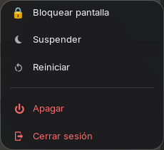
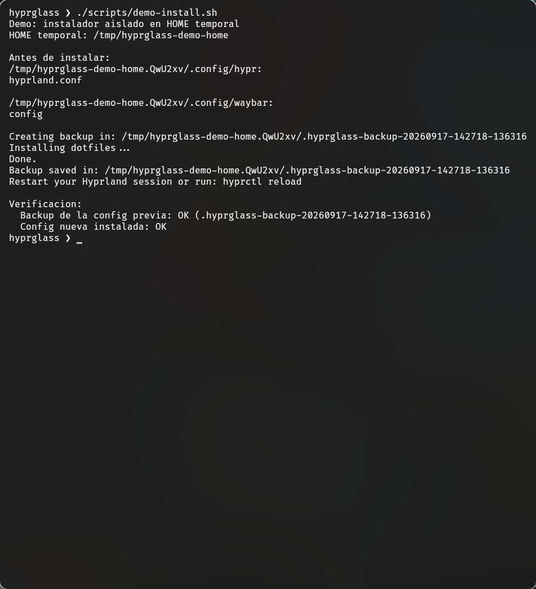

# vaho

**English** · [Español](README.md)

[](https://github.com/AvilaCarlosDev/vaho/actions/workflows/ci.yml)
[](LICENSE)


Vaho is the public, portable subset of my Arch Linux + Hyprland desktop.
Its visual language uses translucent surfaces, rounded geometry and custom GTK
menus. It is not a macOS clone and it does not attempt to reproduce another
desktop environment.

> **Current scope:** tested on Arch Linux with Hyprland 0.56.2 and a ThinkPad
> E14. Hardware keys, battery charge thresholds and monitor names vary between
> computers; the relevant limitations are documented below.

## What is included

- A native Hyprland Lua configuration with gaps, blur, rounded corners,
  animations and keyboard/mouse bindings.
- A floating Waybar with keyboard-layout, media, weather, network, Bluetooth,
  audio, CPU, memory, battery, notifications and power modules.
- Hand-built GTK 3 + GtkLayerShell menus for applications, power, network,
  audio, battery, clipboard, Bluetooth and wallpapers.
- An optional, on-demand headless output with WayVNC for using a tablet as a
  second screen.
- A backup-first installer and automated checks for the public configuration.

The public repository intentionally excludes machine-specific PWAs, private
network profiles, Shimeji processes, absolute home paths, caches and local
backups.

## Screenshots

Waybar:


One of the custom glass menus:



Isolated installer demonstration using the real `install.sh`:



## Requirements

Vaho targets Arch Linux. See [PACKAGES.en.md](PACKAGES.en.md) for the complete,
feature-by-feature package list. The custom menus require **GTK 3,
PyGObject and GtkLayerShell**.

After installing dependencies, check the current machine with:

```sh
./scripts/check-dependencies.sh
```

## Install

Review the repository before installing, then run:

```sh
./install.sh
```

The installer:

1. creates a timestamped backup under `~/.vaho-backup-*`;
2. copies the selected Hyprland, Waybar and GTK preferences;
3. installs the optional battery helper under `~/scripts`.

It replaces the corresponding configuration directories after saving the
backup. It does **not** install system packages, enable services or alter TLP
until the battery helper is invoked explicitly.

## Configuration

### Default applications

Edit these variables near the top of `.config/hypr/hyprland.lua`:

```lua
local terminal = "kitty"
local fileManager = "thunar"
local browser = "firefox"
```

### Keyboard layouts and hardware keys

The default layouts are US and Latin American Spanish, toggled with
`SUPER + Space`. The media-key mappings were tested on a ThinkPad E14. Keys
reported as `XF86Display`, `XF86NotificationCenter` or `XF86Favorites` may be
different or absent on other hardware.

The Fn-row `XF86Favorites` key toggles Bluetooth. This is different from
`SUPER + F12`, which controls the optional tablet output.

### Tablet monitor

Install WayVNC, then press `SUPER + F12` to create or remove the headless
output. Workspace 10 is assigned to it; use `SUPER + 0` and
`SUPER + SHIFT + 0` to focus it or move a window there.

Defaults can be overridden in the Hyprland session:

```sh
export VAHO_PRIMARY_MONITOR=eDP-1
export VAHO_TABLET_MODE=1280x800@60
export VAHO_TABLET_POSITION=1920x0
```

WayVNC is started only when the tablet output is enabled, and Vaho passes
the detected headless output explicitly. WayVNC listens on localhost by
default, so remote access requires your own authenticated WayVNC configuration
and appropriate firewall or private-network rules. Vaho deliberately does
not ship usernames, passwords, certificates or a public-listener default.

### Weather

The Waybar script uses wttr.in and defaults to Caracas as a public example:

```sh
export WEATHER_LOCATION='Caracas,Venezuela'
export WEATHER_LOCATION_PRETTY='Caracas, VE'
```

### Battery thresholds

The battery menu calls TLP through `~/scripts/battery-mode.sh`. This feature is
optional and works only when the laptop firmware and TLP support charge
thresholds. The helper discovers the first power-supply device of type
`Battery`; set `VAHO_BATTERY_PATH` to override it.

The helper uses `sudo` and writes only
`/etc/tlp.d/99-vaho-battery.conf`. Review it before selecting a mode.

## Validation

```sh
./tests/run.sh
```

The checks parse every shell/Python file, validate Waybar JSON, reject known
personal paths and stale components, exercise the installer in an isolated
home directory, and verify that backups preserve the previous content.

The Python menus have two test layers. The logic is tested without GTK or a
display (GTK and the system commands are simulated):

```sh
pip install -r requirements-dev.txt
ruff check .
pytest
```

The UI is tested with real GTK by building each menu and activating its rows
without showing any window. It needs PyGObject and Xvfb (or a display):

```sh
xvfb-run -a python3 -m pytest tests/gtk
```

CI runs all of the above (UI tests under Xvfb), plus ShellCheck, a secret scan (gitleaks) and a
check that rejects AI watermarks in files and commit messages.

## Security and privacy

Do not commit credentials, Wi-Fi/VPN profiles, browser PWAs, logs, shell
history or full home-directory backups. The repository includes only public
configuration. Network passwords are handled by NetworkManager's secret agent,
not passed in command-line arguments.

Security reports should follow [SECURITY.md](SECURITY.md). Contributions are
described in [CONTRIBUTING.md](CONTRIBUTING.md).

## Credits

Created and maintained by [Carlos Avila](https://github.com/AvilaCarlosDev).
Developed with the support of Claude (Anthropic) as an assistant for
architecture review and test writing; design decisions and final review are the
author's. See [CHANGELOG.md](CHANGELOG.md) for the project history.

## License

MIT — see [LICENSE](LICENSE).
